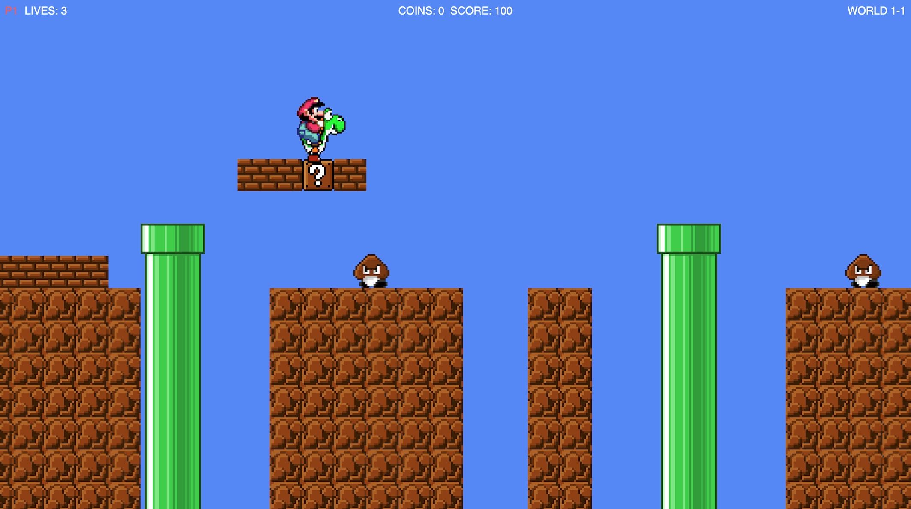

# New Super Mario Bros 2D All Stars

A side-scrolling Super Mario platformer built from scratch with [p5.js](https://p5js.org/) and Claude Code (Opus 4.6 1M).

Three worlds, two players, mushrooms, pipes, Yoshi — and a tongue that eats Goombas. Plug in a controller or grab the keyboard and go.

<p align="center">
  
</p>

## Play online

Click to play in your browser: https://editor.p5js.org/marcocesari/full/vI0fEBG94

> Hosted on the [p5.js Web Editor](https://editor.p5js.org/). The first load takes a few seconds while the music files download. Click anywhere on the canvas first — browsers block audio until you interact with the page.

## Features

- **3 themed worlds** — sky 1-1, underground 1-2, and a sunset 1-3
- **Local co-op** — play solo as Mario or grab a friend to join as Luigi
- **Yoshi!** — hatch him from green eggs, ride him, and eat enemies with his tongue
- **Power-ups** — `?` blocks pop mushrooms that make Mario big (and let him take a hit)
- **Enemies** — Goombas: stomp them or eat them with Yoshi
- **Controller support** — auto-detects Bluetooth gamepads with a guided button-mapping screen
- **Original soundtracks** — ground theme, level clear, lost-a-life, game over


Then visit [http://localhost:8000](http://localhost:8000).

> The page loads p5.js from a CDN, so an internet connection is required on first run.

## Controls

### Keyboard — 1 player

| Action          | Key            |
|-----------------|----------------|
| Move            | `←` / `→`      |
| Jump            | `Space`        |
| Get off Yoshi   | `↑`            |
| Call Yoshi      | `↓`            |
| Yoshi eat       | `Shift`        |
| Restart         | `R`            |

### Keyboard — 2 players

|                 | P1 (Mario)     | P2 (Luigi)     |
|-----------------|----------------|----------------|
| Move            | `←` / `→`      | `A` / `D`      |
| Jump            | `Space`        | `W`            |

### Controller

Pick **"I have a controller"** from the main menu. The setup screen will walk you through pairing your gamepad and mapping each button (move, jump, eat, dismount, call Yoshi, restart). Works with any standard Bluetooth pad — analog stick or D-pad both fine.

## How to play

- **Stomp** Goombas from above.
- **Hit `?` blocks** from underneath. Some give coins, some give mushrooms, some hatch a Yoshi egg.
- **Mount Yoshi** by walking into him. While riding, press the eat button to flick out his tongue and swallow nearby enemies.
- **Reach the flag** at the end of the level to clear it.
- **Don't fall in the pits.** Ever.

## Project layout

```
super_mario_2d/
├── index.html          # entry point
├── sketch.js           # p5 setup / draw / asset preload
├── src/
│   ├── constants.js    # tile size, gravity, speeds, timers
│   ├── levels.js       # tile maps for each world
│   ├── sprites.js      # sprite-sheet coordinates
│   ├── player.js       # Mario / Luigi physics + state
│   ├── enemies.js      # Goomba & Koopa AI
│   ├── yoshi.js        # Yoshi AI, eggs, tongue, riding
│   ├── items.js        # mushrooms, coins, popups
│   ├── collision.js    # tile / entity collision
│   ├── camera.js       # scrolling camera
│   ├── input.js        # keyboard + gamepad polling
│   ├── menu.js         # title / player-select / controller-setup screens
│   └── hud.js          # in-game HUD + overlays
├── assets/             # sprites and music
└── tools/              # sprite-picker dev utilities
```

## Credits

- Code & game design: [marcocesari](https://github.com/marcocesari) and Claude Code (Opus 4.6 1M)
- Built with [p5.js](https://p5js.org/)
- **Sprite sheets** — fan-ripped by the community and hosted on [The Spriters Resource](https://www.spriters-resource.com).
- **Music** — original SNES soundtracks composed by Koji Kondo for *Super Mario Bros.* and *Super Mario World* (Nintendo)

## Disclaimer

This is a **non-commercial fan project** made for fun and learning. Mario, Luigi, Yoshi, and everything else recognizable on screen are trademarks and copyrights of **Nintendo Co., Ltd.** This project is not affiliated with, endorsed by, or sponsored by Nintendo. All rights to the characters, sprites, and music belong to their respective owners.

If you are a rights holder and would like anything removed, please open an issue and it will be taken down promptly.

See [LICENSE](LICENSE) for details — the MIT license covers only the original game code, not the sprite or audio assets.
